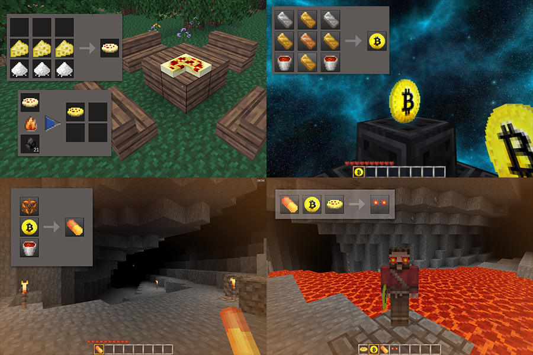

# BTC Stuffs Modpack for Minetest

BTC Stuffs brings iconic items from the Bitcoin universe to your Minetest world. This modpack includes various items tailored for Bitcoin enthusiasts, such as pizza, BTC souvenir, orange pill and laser eyes.

## Mods Included (alias):

- [btc_pizza](./pizza)
- [btc_souvenir](./btc_souvenir)
- [btc_orange_pill](./orange_pill)
- [btc_laser_eyes](./laser_eyes_minetest) for Minetest_game
- [btc_laser_eyes](./laser_eyes_mcl2) for MCL2

## Features:

- Craft iconic Bitcoin-related items and add them to your Minetest world.
- Unique textures and functionalities tailored for Bitcoin enthusiasts.
- Compatibility with Minetest_game and adapted to MineClone2.

## Installation:

1. Download the btc_stuffs modpack.
2. Extract the modpack folder into your Minetest mods directory.
3. Choose the desired mods and enable them separately in your Minetest world settings.
* Attention: Choose between btc_laser_eyes for Minetest_game or MCL2 and enable the correct one.

## Change Log:

- **1.0.0:** Initial release.

## Credits:

- **DogDev:** Author and developer of the btc_stuffs modpack.
- Please check each mod's license to see its original authors and acknowledgments.

