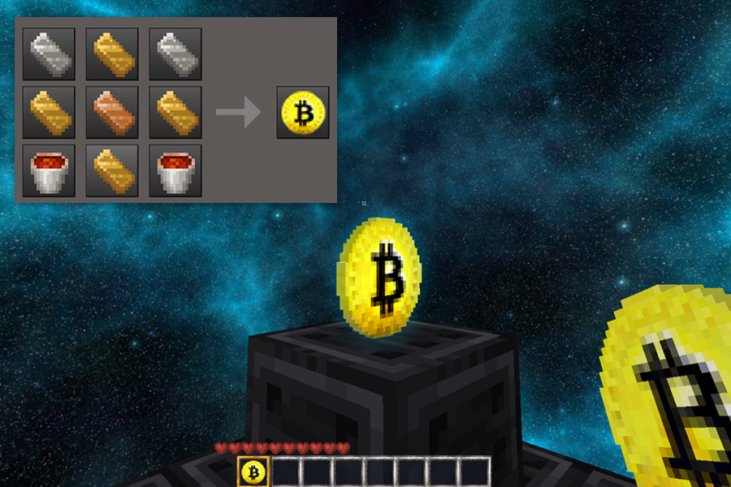

# BTC Souvenir mod [btc_stuffs:btc_souvenir]

BTC Souvenir for minetest adds a 3d bitcoin souvenir. Can be crafted using default Minetest items. Drop it above the nodes to use as a souvenir or can also be used as a pickaxe tool.

Choose the texture size between 16, 32 or 64 pixel at the config page.

Originally developed to work with Minetest_game and was adapted/simplified for MineClone2. Please report malfunctions.

## Change log:

- **1.0.0:** Initial release.

## Known issues

*The item is not persisting in the world when placed on the ground. Unable to prevent its despawn.
**Mod Storage needed for entities to persist when server/client resets.
