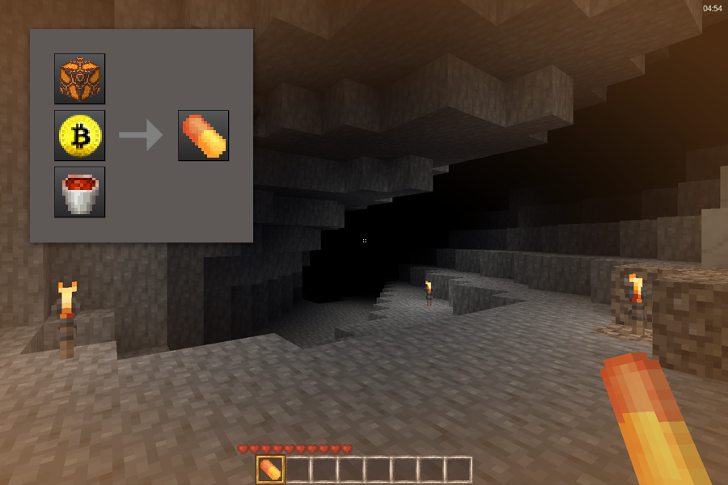

# Orange Pill mod [btc_stuffs:orange_pill]

Orange Pill for minetest adds a buff consumable item. Can be crafted using a orange glazed terracota, a BTC Souvenir and a lava bucket. When consumed, it grants invincibility, precious metal detection, and a buff to the BTC Souvenir in pickaxe mode.

Choose the texture size between 16, 32 or 64 pixel at the config page.

Originally developed to work with Minetest_game and was adapted/simplified for MineClone2. Please report malfunctions.

## Change log:

- **1.0.0:** Initial release.

## Known issues

*The pickaxe buff mode is changing the pickaxe codes values but not reflecting in-game changes.

