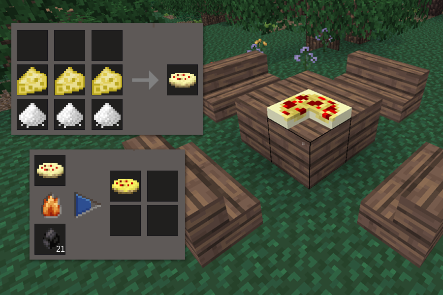

# BTC Pizza mod [btc_pizza]

Pizza mod for minetest adds the pizza food which can be crafted using items from farming (flour) and Mobs Animal (cheese), then cooked to get the pizza and then placed as a block or punched to eat a slice (4 slices per pizza).

Originally developed to work with minetest_game and adapted/simplified for mineclone2. Please report malfunctions.

*Support for hud/hunger and stamina has been added.

## Change log:

- **1.0.0:** Initial release.

## Credits

This mod was based on the Pie mod originally developed by TenPlus1, whose work laid the foundation for this project. The resources and inspiration from the original mod were instrumental in its development. I appreciate TenPlus1's contribution to the Minetest community.

